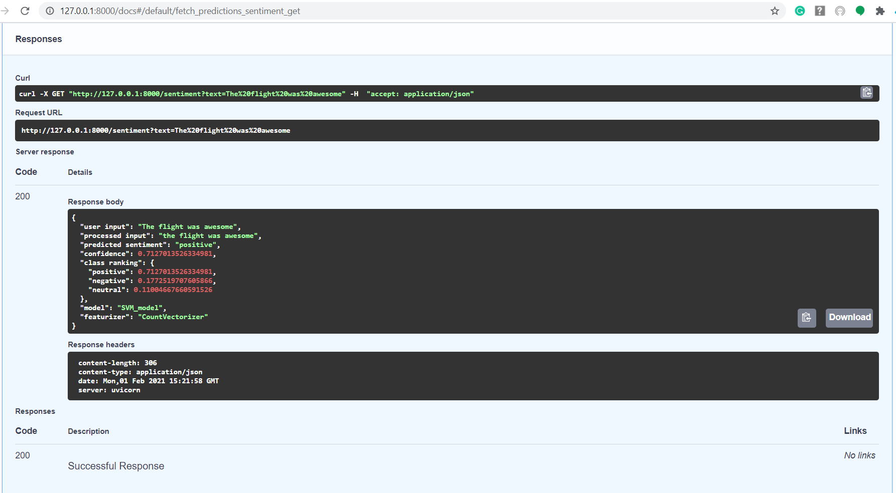

# From classification to web application

The main goal of this repo is to provide an example of how to build your own machine learning-based web application from start to finish. Besides the web app, you can find an example of how to deploy a trained ml model as API using FastAPI.

To top it off, you can run both the ml webapp and fastAPI in Docker🐋

## How to install all requirements 

### 1. Git clone project

```
git clone https://gitlab.com/jasongeniusvoice/ml_webapp.git
```

### 2. Go to project dir

```
cd ml_webapp
```

### 3. Set up a virtual Python environment with [venv](https://docs.python.org/3/library/venv.html)

#### For MacOS users

```
pip install virtualenv
virtualenv venv
source venv/bin/activate
```

#### For Windows users

```
pip install virtualenv
virtualenv venv
venv\Scripts\activate
```

### 4. Install pip libraries

```
pip install -r requirements.txt
```

### 5. train model

```
Open CountVectorizer.ipynb or TF-IDF Vectorizer.ipynb and run this notebook
When the script has finished you are ......
```

### 6. DONE! 
```
You can now run the Django app or FastAPI app
```

## How to run the application (Scroll down for Docker🐋)


### 1. Go to project dir

```
cd app
```

### 2. Start up a server on port 8000

```
python manage.py runserver 8000
```

### 3. Navigate to

```
http://localhost:8000/
```

### How to bring the application down

```
CTRL + C
```

## How to run the application using Docker🐋


### 1. Build image

```
docker-compose build
```

### 2. Run server with logs

```
docker-compose up
```

### 3. Url for Django app

```
http://localhost:8000/
```

### 3. Url for FastAPI app

```
http://localhost:9000/docs
```

### How to bring the image down

```
CTRL + C
```

### How to display all docker images

```
docker images
```
### How to remove a docker image

```
docker rmi <IMAGE ID>
```

### There are 2 webapps (ML-based & DL-based)

you can switch between ML & DL by using git checkout

**for the machine learning version use**
```
git checkout ML/webapp
```

**for the deep learning version use**
```
git checkout DL/webapp
```

# How to serve model using FastAPI

### 1. Go to project dir

```
cd app
```

### 2. Run main.py

```
uvicorn main:app --reload
```

### 3. navigate to

```
http://127.0.0.1:8000/docs
```

### Example response for "the flight was awesome"



### How to bring FastAPI down

```
CTRL + C
```


